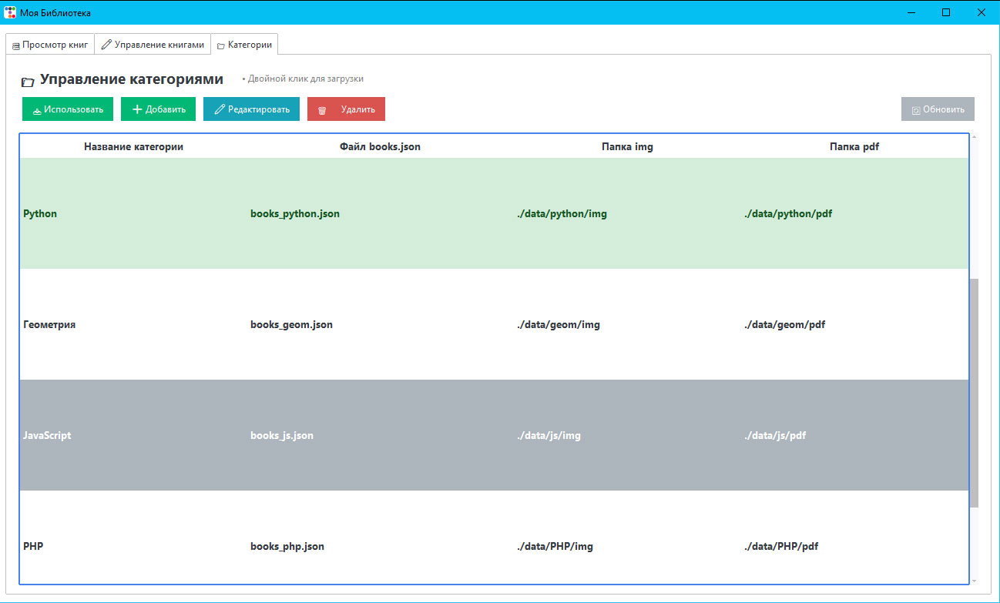
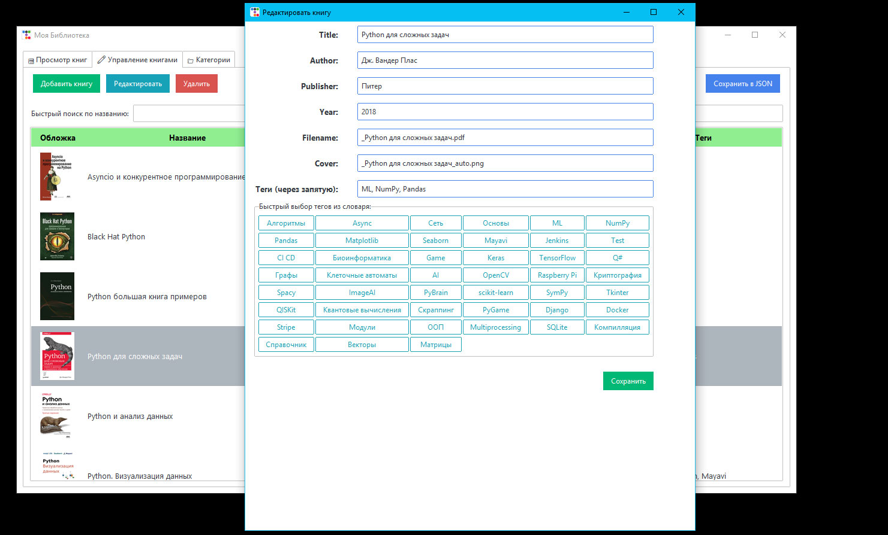
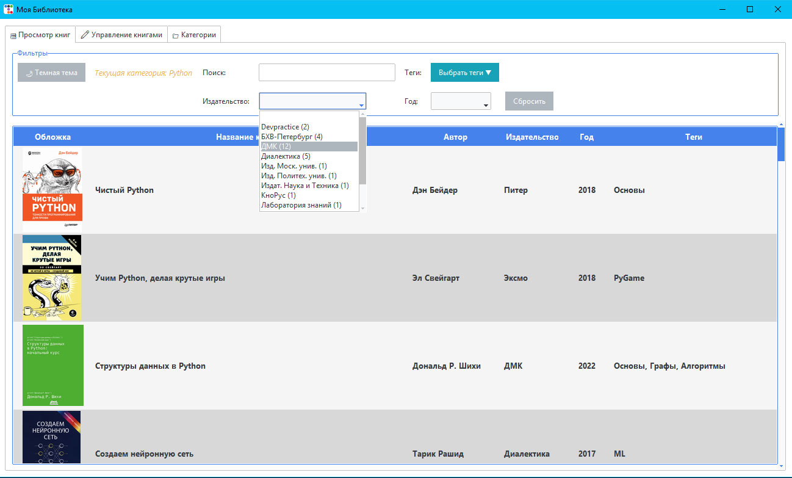
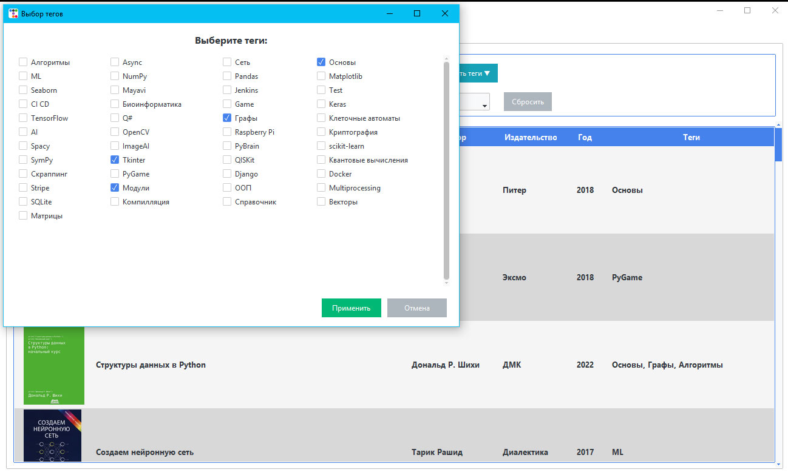
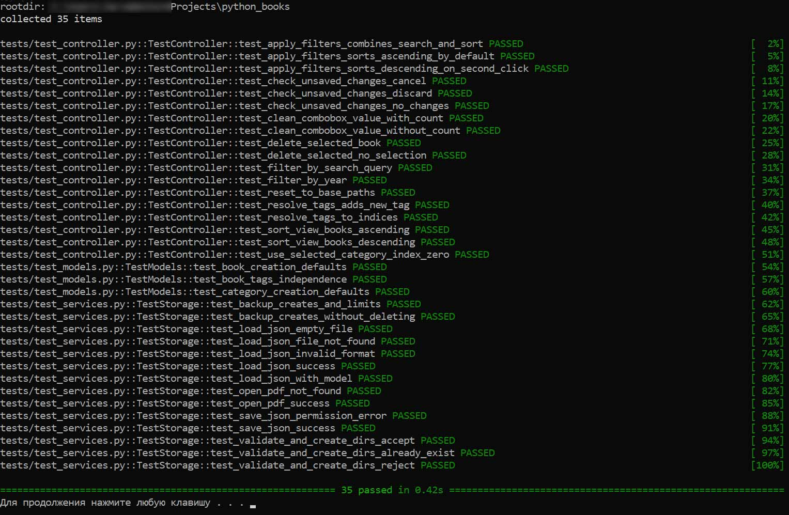

## Библиотека для ведения каталога книг (pdf)

### Как пользоваться:
1. Создаете нужную вам категорию - нужно указать название Категории  (например Математика), имя файла json в котором будут храниться данные этой категории, и два пути - для самих файлов pdf и для их обложек img.
Я использую такую структуру каталогов:
```
data/
│
├── PHP/
│   ├── img/
│   └── pdf/
│
├── JavaScript/
│   ├── img/
│   └── pdf/
├── ...../
│   ├── img/
│   └── pdf/
```
где PHP и JavaScript - названия категорий.
Файлы с базами json создаются в корне программы. Если нужных путей нет - они будут созданы!

2. Загружаете в папку pdf книги соответсвующие категории.
3. Выбираете нужную категорию и добавляете в нее информацию о новой книге. Важно - укажите теги, чем особенна данная книга.
4. После нажатия кнопки сохранить, будет сделана попытка просканировать книгу по указанному пути и создать для неё обложку.
5. После нажатия кнопки "Сохранить в JSON" книга будет сохранена в базе.
6. При необходимости, можно отредактировать все поля книги в любой момент. Если забудете сохранить в json - программа предупредит об этом.
7. При просмотре сохраненных книг можно использовать поиск и фильтры.
8. Самое полезное - поиск по тегам. К примеру, вы хотите отфильтровать книги в которых написано про БД - отмечаете нужные теги (MySQL, maria, MSSQL)
9. Перед сохранением новой версии файла json - происходит копирование(backup) старой. Всего хранится 3 последних сохранения каждого файла.
10. Если добавленную книгу не видите во вкладке "Просмотр книг" - сбросьте фильтры

### Реализованы:
 - Выбор категории книг для просмотра

 

 - Добавление\редактирование\удаление категорий
 - Добавление\редактирование\удаление книг в каждой категории

 

 - Автосоздание превью книги из файла .pdf при добавлении (если есть готовое превью - вписываете в поле имя этого файла)
 - Просмотр таблицы с книгами

 

 - Сортировка по столбцам название, автор, издательство, год
 - Фильтр по поиску в названии, авторе
 - Фильтр по издательству, году
 - И главное (ради чего, собственно, и делал это) выбор по тегам

 

 - Добавление кликом существующих тегов (в редактировании книги), добавление новых тегов
 - Редактирование тегов, затрагивающее все книги в категории - происходит в разделе категорий
 - Хранение информации в json-файлах, каждая категория в отдельном файле (БД не используется)
 - При любых изменениях данных попытка закрыть программу или сменить категорию выдаст предупреждение о необходимости сохранить.
 - При сохранении происходит бекап записываемого файла в директорию backup
 - Сохраняются три последних модификации каждого файла.
 - Светлая и темная тема.

 

 - При загрузке всегда выбрана Базовая категория(книги без категории или вообще, пустая может быть).
 - Добавлены тесты, для уверенности при любом рефакторинге.

 

 - Архитектурно MVC - но возможны "протекания", строго не следил за этим.
 - При двойном клике по обложке книге (в первой вкладке) происходит открытие книги во внешнем редакторе (если книга есть в наличии по указанному пути!)
 - Для демонстрации оставил папку data и обложки в архиве и репо. Самих книг там нету!


### Структура каталогов и файлов:
```
library_app/
│
├── models/
│   ├── __init__.py
│   ├── category.py
│   └── book.py
│
├── services/
│   ├── __init__.py
│   ├── storage.py
│   ├── book_service.py
│   ├── filter_service.py
│   ├── validators.py
│   └── cover_service.py
│
├── state/
│   ├── __init__.py
│   └── app_state.py
│
├── controllers/
│   ├── __init__.py
│   └── app_controller.py
│
├── views/
│   ├── dialogs/
│   │   ├── __init__.py
│   │   ├── book_form.py
│   │   └── tag_selector.py
│   ├── __init__.py
│   ├── main_view.py
│   ├── categories_view.py
│   ├── edit_view.py
│   └── books_view.py
│
├── main.py
└── __init__.py
```