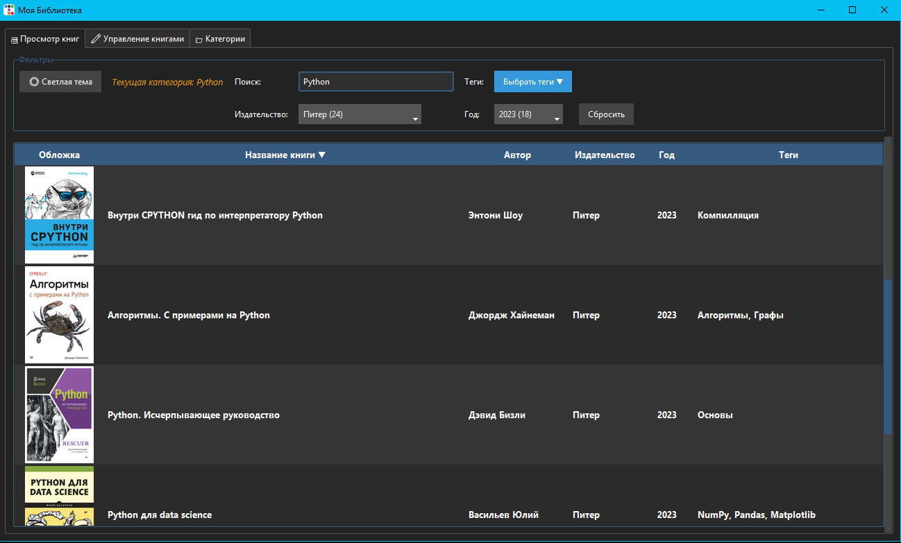

## MyLibrary - приложение для создания каталога книг (*.pdf)
 

- Код - Python3
- GUI - tkinter
- Стилизация - ttkbootstrap
- Создание превью из pdf - PyMuPDF
- Данные - файлы json

Скомпилированная версия находится в [релизе][1] (для Windows 10)

### [Как пользоваться][2]

### Для продолжения разработки (требуется Python 3.13):
Установка виртуального окружения и зависимостей - install.bat
Запуск приложения из исходного пакета - run.bat
Запуск тестов - test.bat

### Для тех кто хочет сам скомпилировать приложение:
Я делал на windows10, Python 3.13, использовал Nuitka 4.1.1.
1. Скачайте Visual Studio Build Tools отсюда: https://visualstudio.microsoft.com/ru/visual-cpp-build-tools/
2. При установке поставьте галочку на "Разработка классических приложений на C++" (Desktop development with C++)
3. В вашем активированном виртуальном окружении выполните:

```pip install nuitka ordered-set ```

4. Затем компиляция:

```python -m nuitka --standalone --enable-plugin=tk-inter --nofollow-import-to=pymupdf --include-package=library_app --no-deployment-flag=excluded-module-usage --include-package-data=ttkbootstrap --windows-console-mode=disable  --windows-icon-from-ico=icon.ico --output-dir=dist --output-filename=MyLibrary.exe launcher.py```

5. Из папки виртуального окружения ```venv/Lib/site-packages/``` скопируйте в директорию где лежит MyLibrary.exe папку ```pymupdf``` со всем содержимым.
6. Из папки ```~\AppData\Local\Programs\Python\Python313``` скопируйте в папку ```pymupdf``` файл ```python3.dll```

После всего этого должно получится рабочее приложение.
Если компиляция не удалась - перед повторной компиляцией лучше очистить кэш:
```python -m nuitka --clean-cache=all ```

### Коротко по использованным опциям компиляции:

| Опция | Что делает | Зачем нужна в вашем проекте |
| --- | --- | --- |
| `--standalone` | Создаёт автономную сборку со встроенным Python и всеми DLL | Приложение работает на ПК без установленного Python |
| `--enable-plugin=tk-inter` | Активирует плагин Tkinter | Корректно копирует `tk*.dll`, `tcl*.dll` и настраивает пути для GUI |
| `--nofollow-import-to=pymupdf` | Исключает `pymupdf` из C-компиляции | Обходит ошибку `C1002: out of heap space` из-за огромного размера модуля |
| `--include-package=library_app` | Принудительно включает ваш пакет в сборку | Гарантирует, что `views/`, `controllers/`, `services/` попадут в `.exe` |
| `--no-deployment-flag=excluded-module-usage` | Разрешает импорт исключённых модулей во время выполнения | Позволяет загружать `pymupdf` из папки `.dist/` при генерации обложки |
| `--include-package-data=ttkbootstrap` | Копирует не только `.py`, но и ресурсы пакета | Подтягивает темы, шрифты, иконки и JSON-конфиги `ttkbootstrap` |
| `--windows-console-mode=disable` | Запускает без чёрного окна консоли | Делает приложение "чистым" GUI-окном (современный аналог `--windows-disable-console`) |
| `--windows-icon-from-ico=icon.ico` | Вшивает иконку в `.exe` | `.exe` и окна приложения отображаются с вашей кастомной иконкой |
| `--output-dir=dist` | Указывает папку вывода | Все артефакты сборки складываются в `dist/` |
| `--output-filename=MyLibrary.exe` | Задает имя итогового файла | Удобное имя вместо `launcher.exe` |
| `launcher.py` | Точка входа | Файл, с которого начинается выполнение программы (обёртка для обхода относительных импортов) |

Еще пару слов о компиляции. Использованная в приложении библиотека PyMuPDF для создания превью из pdf-файла - это уже скомпилированный пакет и весит он 50мб, смысла перекомпилировать его нет, поэтому исключаем его из компиляции опцией ```--nofollow-import-to=pymupdf```, но обязательно нужно разрешить использование его как внешнего пакета ```--no-deployment-flag=excluded-module-usage```.

launcher.py потребовался, именно на этапе компиляции, для разрешения относительных путей в пакете. Также, в файле ```cover_service.py``` (использующий импорт внешнего пакета pymupdf) используется "ленивый" импорт, к тому же различающий импорт в готовом *.exe и в исходнике.

[1]: https://github.com/black1277/python_books/releases/tag/v1.0.0 "Release"
[2]: library_app/readme.md "readme"